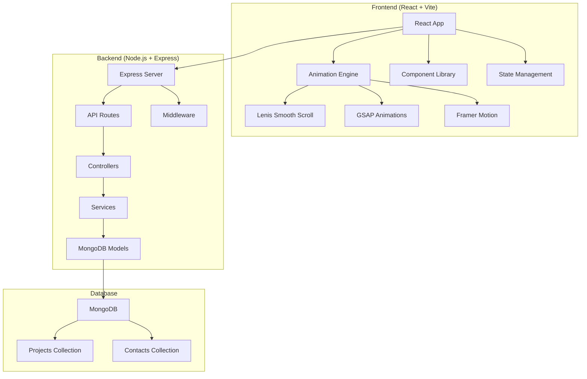

# Design Document

## Overview

The Portfolio Transformation System is a modern full-stack web application that converts a static HTML portfolio into a dynamic, animated React-based platform. The system combines a React frontend with advanced animation libraries (Lenis, GSAP, Framer Motion) and a Node.js/Express backend with MongoDB for content management. The architecture prioritizes performance, maintainability, and user experience while providing comprehensive portfolio management capabilities.

## Architecture

### System Architecture



### Technology Stack

**Frontend:**

- React 18 with Vite for fast development and building
- Tailwind CSS for utility-first styling
- Lenis for smooth scrolling experience
- GSAP for scroll-triggered and timeline animations
- Framer Motion for component-level animations and transitions
- Axios for HTTP client communication

**Backend:**

- Node.js runtime environment
- Express.js web framework
- MongoDB with Mongoose ODM
- CORS for cross-origin resource sharing
- dotenv for environment variable management
- Express validator for input validation

**Development Tools:**

- ESLint for code linting
- Prettier for code formatting
- Nodemon for backend development
- Vite dev server for frontend development

## Components and Interfaces

### Frontend Component Architecture

```
src/
├── components/
│   ├── common/
│   │   ├── Header.jsx
│   │   ├── Footer.jsx
│   │   ├── LoadingSpinner.jsx
│   │   └── ScrollToTop.jsx
│   ├── sections/
│   │   ├── Hero.jsx
│   │   ├── About.jsx
│   │   ├── Skills.jsx
│   │   ├── Projects.jsx
│   │   ├── Experience.jsx
│   │   └── Contact.jsx
│   └── ui/
│       ├── Button.jsx
│       ├── Card.jsx
│       ├── Modal.jsx
│       └── Form.jsx
├── hooks/
│   ├── useAnimation.js
│   ├── useApi.js
│   └── useScrollTrigger.js
├── services/
│   ├── api.js
│   └── animations.js
├── utils/
│   ├── constants.js
│   └── helpers.js
├── styles/
│   └── globals.css
└── App.jsx
```

### Backend API Architecture

```
backend/
├── controllers/
│   ├── projectController.js
│   └── contactController.js
├── models/
│   ├── Project.js
│   └── Contact.js
├── routes/
│   ├── projects.js
│   └── contacts.js
├── middleware/
│   ├── auth.js
│   ├── validation.js
│   └── errorHandler.js
├── config/
│   └── database.js
├── utils/
│   └── helpers.js
└── server.js
```

### API Endpoints

**Projects API:**

- `GET /api/projects` - Retrieve all projects
- `GET /api/projects/:id` - Retrieve specific project
- `POST /api/projects` - Create new project
- `PUT /api/projects/:id` - Update existing project
- `DELETE /api/projects/:id` - Delete project

**Contacts API:**

- `POST /api/contacts` - Submit contact form
- `GET /api/contacts` - Retrieve all contact submissions (admin)

### Component Interfaces

**Project Component Interface:**

```typescript
interface Project {
  _id: string;
  title: string;
  description: string;
  technologies: string[];
  imageUrl: string;
  liveUrl?: string;
  githubUrl?: string;
  featured: boolean;
  createdAt: Date;
}
```

**Contact Form Interface:**

```typescript
interface ContactForm {
  name: string;
  email: string;
  subject: string;
  message: string;
}
```

## Data Models

### MongoDB Schemas

**Project Schema:**

```javascript
const projectSchema = new mongoose.Schema(
  {
    title: {
      type: String,
      required: true,
      trim: true,
      maxLength: 100,
    },
    description: {
      type: String,
      required: true,
      maxLength: 500,
    },
    technologies: [
      {
        type: String,
        required: true,
      },
    ],
    imageUrl: {
      type: String,
      required: true,
    },
    liveUrl: {
      type: String,
      validate: {
        validator: function (v) {
          return /^https?:\/\/.+/.test(v);
        },
        message: "Invalid URL format",
      },
    },
    githubUrl: {
      type: String,
      validate: {
        validator: function (v) {
          return /^https?:\/\/.+/.test(v);
        },
        message: "Invalid URL format",
      },
    },
    featured: {
      type: Boolean,
      default: false,
    },
  },
  {
    timestamps: true,
  }
);
```

**Contact Schema:**

```javascript
const contactSchema = new mongoose.Schema(
  {
    name: {
      type: String,
      required: true,
      trim: true,
      maxLength: 100,
    },
    email: {
      type: String,
      required: true,
      validate: {
        validator: function (v) {
          return /^[^\s@]+@[^\s@]+\.[^\s@]+$/.test(v);
        },
        message: "Invalid email format",
      },
    },
    subject: {
      type: String,
      required: true,
      trim: true,
      maxLength: 200,
    },
    message: {
      type: String,
      required: true,
      maxLength: 1000,
    },
    status: {
      type: String,
      enum: ["unread", "read", "replied"],
      default: "unread",
    },
  },
  {
    timestamps: true,
  }
);
```

## Animation System Design

### Lenis Smooth Scroll Integration

```javascript
// Smooth scroll initialization
const initSmoothScroll = () => {
  const lenis = new Lenis({
    duration: 1.2,
    easing: (t) => Math.min(1, 1.001 - Math.pow(2, -10 * t)),
    direction: "vertical",
    gestureDirection: "vertical",
    smooth: true,
    mouseMultiplier: 1,
    smoothTouch: false,
    touchMultiplier: 2,
    infinite: false,
  });

  // Connect Lenis with GSAP ScrollTrigger
  lenis.on("scroll", ScrollTrigger.update);

  gsap.ticker.add((time) => {
    lenis.raf(time * 1000);
  });

  return lenis;
};
```

### GSAP Animation Patterns

**Scroll-triggered Animations:**

```javascript
// Section reveal animation
gsap.registerPlugin(ScrollTrigger);

const animateSection = (element) => {
  gsap.fromTo(
    element,
    {
      y: 100,
      opacity: 0,
    },
    {
      y: 0,
      opacity: 1,
      duration: 1,
      ease: "power2.out",
      scrollTrigger: {
        trigger: element,
        start: "top 80%",
        end: "bottom 20%",
        toggleActions: "play none none reverse",
      },
    }
  );
};
```

### Framer Motion Integration

**Component Animations:**

```javascript
// Page transition variants
const pageVariants = {
  initial: {
    opacity: 0,
    y: 20,
  },
  in: {
    opacity: 1,
    y: 0,
  },
  out: {
    opacity: 0,
    y: -20,
  },
};

const pageTransition = {
  type: "tween",
  ease: "anticipate",
  duration: 0.5,
};
```

Now I need to use the prework tool to analyze the acceptance criteria before writing the correctness properties.

## Correctness Properties

_A property is a characteristic or behavior that should hold true across all valid executions of a system-essentially, a formal statement about what the system should do. Properties serve as the bridge between human-readable specifications and machine-verifiable correctness guarantees._

### Property Reflection

After analyzing all acceptance criteria, I identified several areas where properties can be consolidated:

- Multiple responsive design criteria (7.1, 7.2, 7.3) can be combined into a comprehensive responsive layout property
- CRUD operations (3.2, 3.3, 3.4) can be consolidated into a comprehensive API operations property
- Form validation criteria (5.1, 5.4) can be combined into a comprehensive validation property
- Animation properties (2.2, 2.3, 2.4) can be consolidated to avoid redundancy

### Core Properties

**Property 1: Tailwind CSS Usage Consistency**
_For any_ component in the application, all styling should use Tailwind CSS classes and no other CSS frameworks should be present
**Validates: Requirements 1.2**

**Property 2: Responsive Layout Adaptation**
_For any_ viewport width, the application should adapt its layout appropriately for mobile (320px+), tablet (768px-1024px), and desktop (1024px+) breakpoints
**Validates: Requirements 7.1, 7.2, 7.3**

**Property 3: Animation Engine Integration**
_For any_ user interaction or scroll event, the appropriate animation library (GSAP for scroll triggers, Framer Motion for interactions) should be used consistently
**Validates: Requirements 2.2, 2.3, 2.4**

**Property 4: Project CRUD Operations**
_For any_ project data operation (create, read, update, delete), the API should handle the request correctly and maintain data integrity in MongoDB
**Validates: Requirements 3.1, 3.2, 3.3, 3.4**

**Property 5: API Response Standards**
_For any_ API request, the response should include proper HTTP status codes and consistent error handling
**Validates: Requirements 4.2, 4.4**

**Property 6: Database Schema Validation**
_For any_ data operation, Mongoose schemas should validate input data and enforce constraints before database operations
**Validates: Requirements 4.5**

**Property 7: Contact Form Validation**
_For any_ contact form submission, all required fields should be validated and appropriate feedback should be provided to the user
**Validates: Requirements 5.1, 5.3, 5.4, 5.5**

**Property 8: Contact Form Data Persistence**
_For any_ valid contact form submission, the data should be stored in MongoDB and the form should be reset with success feedback
**Validates: Requirements 5.2, 5.5**

**Property 9: Image Optimization**
_For any_ image displayed in the application, lazy loading should be implemented for non-critical images and appropriate sizes should be served
**Validates: Requirements 7.5, 8.3**

**Property 10: Environment Configuration**
_For any_ configuration setting, environment variables should be used instead of hardcoded values
**Validates: Requirements 4.3, 9.2**

**Property 11: Code Quality Standards**
_For any_ code file, consistent coding standards, naming conventions, and comprehensive comments should be maintained
**Validates: Requirements 10.1, 10.3**

**Property 12: Component Architecture**
_For any_ React component, it should follow reusable architecture patterns and be properly structured
**Validates: Requirements 10.2**

## Error Handling

### Frontend Error Handling

**API Communication Errors:**

- Network timeouts: Display user-friendly retry options
- Server errors (5xx): Show generic error message with support contact
- Client errors (4xx): Display specific validation messages
- Connection failures: Implement offline mode indicators

**Animation Errors:**

- Library loading failures: Graceful degradation to CSS transitions
- Performance issues: Automatic animation reduction on low-end devices
- Scroll conflicts: Proper cleanup and event listener management

**Form Validation Errors:**

- Real-time field validation with immediate feedback
- Comprehensive error message display
- Accessibility-compliant error announcements
- Form state preservation during errors

### Backend Error Handling

**Database Errors:**

- Connection failures: Automatic retry with exponential backoff
- Validation errors: Detailed field-specific error responses
- Duplicate key errors: User-friendly conflict resolution messages
- Query timeouts: Proper error logging and user notification

**API Errors:**

- Malformed requests: Structured error responses with field details
- Authentication failures: Clear unauthorized access messages
- Rate limiting: Proper 429 responses with retry-after headers
- Server overload: Graceful degradation and load balancing

**Validation Errors:**

- Input sanitization failures: Secure error handling without data exposure
- Schema validation: Comprehensive field validation with specific messages
- File upload errors: Size and type validation with clear feedback

### Error Response Format

```javascript
{
  "success": false,
  "error": {
    "code": "VALIDATION_ERROR",
    "message": "Invalid input data",
    "details": [
      {
        "field": "email",
        "message": "Invalid email format"
      }
    ]
  },
  "timestamp": "2024-01-07T12:00:00Z"
}
```

## Testing Strategy

### Dual Testing Approach

The application will implement both unit testing and property-based testing to ensure comprehensive coverage:

**Unit Tests:**

- Test specific examples and edge cases
- Verify component rendering and behavior
- Test API endpoint responses
- Validate form submission flows
- Test error handling scenarios

**Property-Based Tests:**

- Verify universal properties across all inputs
- Test responsive design across viewport ranges
- Validate API operations with generated data
- Test animation performance across different scenarios
- Verify data validation with random inputs

### Testing Configuration

**Frontend Testing:**

- **Framework:** Vitest with React Testing Library
- **Property Testing:** fast-check for property-based tests
- **Animation Testing:** Mock animation libraries for consistent testing
- **Responsive Testing:** Viewport simulation for different screen sizes

**Backend Testing:**

- **Framework:** Jest with Supertest for API testing
- **Property Testing:** fast-check for data validation testing
- **Database Testing:** MongoDB Memory Server for isolated testing
- **Integration Testing:** Full API workflow testing

**Property Test Configuration:**

- Minimum 100 iterations per property test
- Each property test tagged with: **Feature: portfolio-transformation, Property {number}: {property_text}**
- Performance properties excluded from automated testing (manual performance audits)

### Test Coverage Requirements

**Unit Test Coverage:**

- Component rendering: All major components and their states
- API endpoints: All CRUD operations and error scenarios
- Form validation: All validation rules and edge cases
- Animation initialization: Library setup and configuration
- Error handling: All error scenarios and recovery paths

**Property Test Coverage:**

- Responsive design: Layout adaptation across viewport ranges
- Data operations: CRUD operations with generated test data
- Form validation: Input validation with random data generation
- API responses: Consistent response format across all endpoints
- Configuration management: Environment variable usage verification

**Integration Test Coverage:**

- End-to-end user workflows: Contact form submission, project viewing
- Animation integration: Smooth scroll and animation coordination
- Database operations: Full data lifecycle testing
- Error recovery: System behavior during failure scenarios
- Performance validation: Load testing for critical user paths

The testing strategy ensures that both concrete examples work correctly (unit tests) and that universal properties hold across all possible inputs (property tests), providing comprehensive validation of system correctness.
